# CIS 566 Homework 3: Environment Setpiece
Jason Wang (jasonwa)

Warning, scene is really slow. Reducing resolution to the size of shadertoy and using Firefox will make the experience much better.

Scene Motivation:

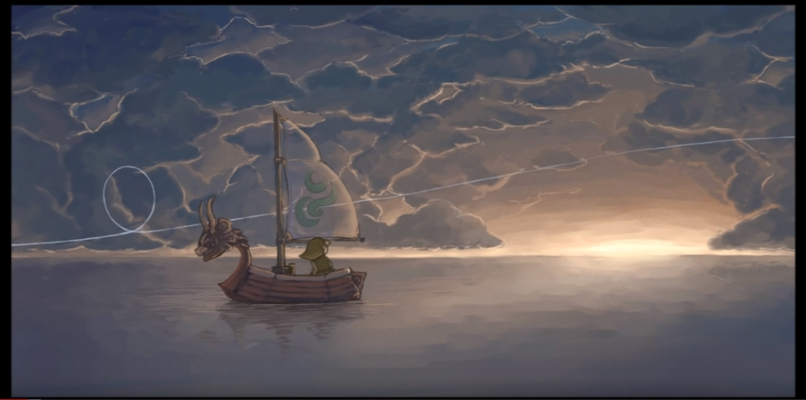

Demo: https://jwang5675.github.io/hw03-environment-setpiece/

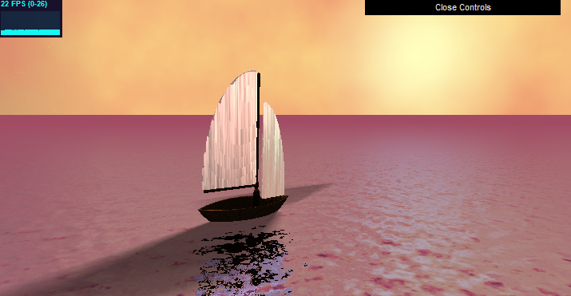

Sources:
  - The math for SDFs/Normals/Etc. info was adopted from class slides or from http://www.iquilezles.org/

## Features Implemented
Here is a high-level overview of implemented features

- Animation of the sky box to simulate night and day, animation of water normals to create illusion of moving water waves, animation of boat to sway from side to side over time
- Noise to create flattened 3d FBM wood texture on boat, fbm to offset normals to simulate water waves, fbm to create skybox colors, cloud fog, and star position, fbm to offset normals on sail in y direction to create sail ripples
- Sphere UV mapping far clip camera points to generate the skybox color for the scene
- Use of sin and cos toolbox functions to have smooth animation and color smoothing with mix throughout the scene’s skybox colors and shadows
- Environment lighting using 2 ambient lights (one above the boat to have light at night time and one behind the sails to cause ripples with subsurface scattering), and 2 rotating lights representing the sun and the moon light for soft shadows on the boat/water and colored subsurface scatting on the boat sail during sunset and moonset.
- SDF-based soft shadows as penumbra shadows using the light direction from the sun and moon

- Ray-based specular reflection on the water using fbm displaced normals
- Rim lighting/Subsurface scattering on the boat sails
- Small amount of distance fog added to the edge of the water near horizon to make the horizon darker in color and not as reflective compared to the foreground of the water.

## Implementation Details

There are 3 main aspects of the scene. I will discuss them in detail below.

Skybox:
- The skybox is a sphere UV mapping based on the direction vector of a ray that hits the far clip plane of the camera. 
- The skybox works by having the sun and the moon rotate along the circumference of the x-y circle cut of the sphere where the sun is half a period of rotation ahead of the moon. The movement of the sun and moon determines on the state of the day.
- For each quadrant of the x-y circle, there is one dominating "state of day" for the sky box: sunset, sunrise, day, and night. Basically, as the x and y position of the sun moves from -1 to 1, the state of day moves from day -> sunset -> night -> sunrise -> day...
- Each state of day has a specific pallet of colors that is interpolated based the height of the skybox. In addition, each state of day has some distortion added to the sky to make it not as uniform using fbm.
- The sun and the moon represent an angle in the sky and the color of the sun and moon fades out with the sky in the background using linear interpolation like a halo.
- In addition, the night sky has fbm placed stars in the sky

Sunset

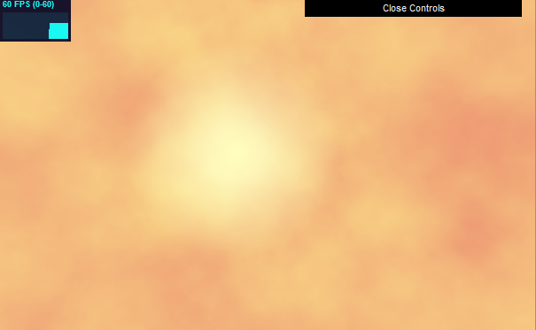

Night

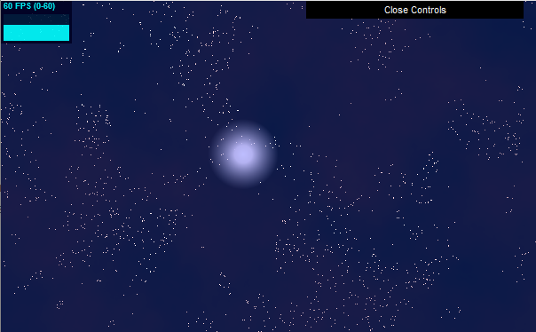

Moonset/Sunrise

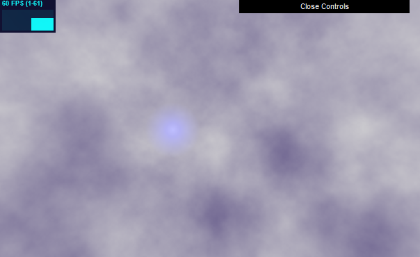

Day

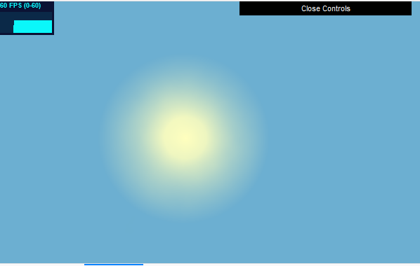

Water:
- The water is a plane along the y = 0 axis. 
- The water is perfectly specular reflective and reflect colors along the normal of the water
- The normal of the water is calculated by randomly offsetting the plane's (0, 1, 0) normal vector using 3d FBM on (x, z, time) where x and z are points on the plane and time is the time of day. Using the fbm, we offset the x and y portions of the normal by a small amount and then normalizing the result to create the water normal
- The shadows on the water are penumbra shadows from the sun and moon as the rotate in the sky. 
- The final color of the water is calculated by (blue water color) * (reflective color of boat sdf and skybox) * (penumbra shadow from boat)

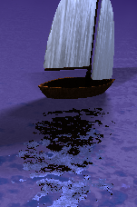

Sailboat:
- The sail boat is made using a collection of sdf union, subtraction, and intersections. 
- The base of the boat is made by creating a large sphere, subtracting a large cylinder from sphere to leave the bottom arc portion, removing the bottom portion of the arc to look like a circle, and then subtracting the shape along a raised version of itself to make the hollow base of the boat.
- The sail of the boat is made from a union of vertical and horizonal capsules and the sails are made from scaled spheres intersected with a translated box to get a single quadrant of the sphere. The sphere is then scaled up to make the elliptical shape of the sail.
- The color of the boat is created with flattening 3d fbm by rising the x height of the point sampled, multiplying the result by 10 and then taking the fract of the result. This allows rings to be created from the height field and I interpolated the color of the boat using the fbm noise on a light and dark wood grain color.

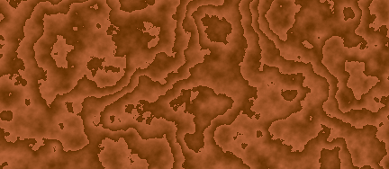

- The ripples on the sail of the ship are created similar to the water normals. I offset the normals along the y direction using fbm like the water normal method. I then added subsurface scattering to the sails to make the ripples noticeable as the ship sways over time.

Sail during the day:

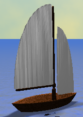

Sail during the night:

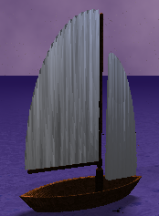

- The sail also has subsurface scattering with the sun and the moon lights. The sails scatter a more red and orange color during the sunset and has a bluer hue during the moon setting phase when the sun and moon are behind the sail in the scene. 

Sail during sunset, has orange and red color from subsurfacing scattering:

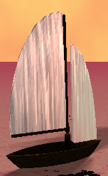

Sail during moon setting, has blue color from subsurfacing scattering:

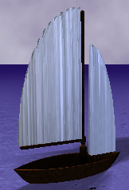

## Extra Credit
- Class Critique